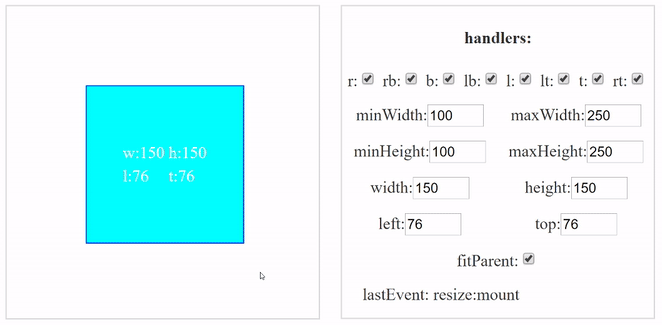

# VueResizable

[](https://npmjs.com/package/vue-resizable)
[](https://www.npmjs.com/package/vue-resizable)
[](LICENSE.md)

 

> Vue component that allows you to resize and drag elements

### Demo

<a href="https://nikitasnv.github.io/vue-resizable/" target="_blank">Demo page</a>\
<a href="https://codesandbox.io/s/13qp7xk787" target="_blank">CodeSandbox</a>\
<a href="https://codepen.io/nikitasnv/pen/YzPXKNw" target="_blank">Material window</a>

## Installation

```sh
npm install vue-resizable --save
```

## Basic usage

```vue
<template>
    <vue-resizable>
        <div class="resizable-content"></div>
    </vue-resizable>
</template>

<script>
import VueResizable from 'vue-resizable'

export default {
    name: "YourApp",
    components: {VueResizable}
}
</script>

<style scoped>
    .resizable-content {
        height: 100%;
        width: 100%;
        background-color: aqua;
    }
</style>
```

## Properties


| Property            |  Data attribute    | Type    | Default | Description                                                                                                                                                                                                                                                                           |
|:--------------------|------|:--------|:--------|:--------------------------------------------------------------------------------------------------------------------------------------------------------------------------------------------------------------------------------------------------------------------------------------|
| width               |   w   | [Number, String] | undefined   | Width           
| minWidth            |   minW   | Number  | 0    |  Minimum width     
| maxWidth            |   maxW    | Number | undefined   | Maximum width
| height               |  h   | [Number, String]  | undefined    | Height                                                                                                                                                                                                                    |
| minHeight        | minH | Number  | 0       | Minimum height                                                                                                                                                                                                                |
| maxHeight    | maxH | Number  | undefined       | Maximum height                                                                                                                                                                                                                              |
| left          |   l    | [Number, String] | 0    | Offset left from parent                                                                                                                                                                                                                                                     |
| top       | t | [Number, String] | 0   | Offset top from parent          
| active     |    | Array | ['r', 'rb', 'b', 'lb', 'l', 'lt', 't', 'rt']   | Active handlers for resize    
| fitParent    |     | Boolean | false  | Respect parent's size on resizing
| dragSelector | dragElements  |  String | undefined | Drag selector
| maximize | | Boolean | false| Maximize element to parent size
| disableAttributes | calcMap | Array | [] | Disable changes to attributes, Available values: ['l', 't', 'w', 'h']

## Events

| Name            |  Payload   |  Description                                                                                                                                                                                                                                                                           |
|:--------------------|-------------|:--------------------------------------------------------------------------------------------------------------------------------------------------------------------------------------------------------------------------------------------------------------------------------------|
| mount               |   [eventName,left,top,width,height]      | Called after the component is mounted 
| destroy               |   [eventName,left,top,width,height]      | Called before the component is destroyed 
| resize:start               |   [eventName,left,top,width,height]      | Called after clicking on one of the active handlers 
| resize:move               |   [eventName,left,top,width,height]      | Called when a handler is being dragged
| resize:end               |   [eventName,left,top,width,height]      | Called when the mouse button was released after resize
| drag:start | [eventName,left,top,width,height] | Called after clicking on one of the drag elements
| drag:move |  [eventName,left,top,width,height] | Called when a drag element is being dragged
| drag:end | [eventName,left,top,width,height] | Called when the mouse button was released after drag
| maximize | [eventName,left,top,width,height, state] | Called when "maximize" state changed

## Development


To begin development, run:

``` bash
npm install 
npm run dev
```
It starts [webpack-dev-server](https://github.com/webpack/webpack-dev-server) on `localhost:8080` with [Demo](./docs) page.

## License

This project is licensed under the MIT License - see the [LICENSE.md](LICENSE.md) file for details.


     
